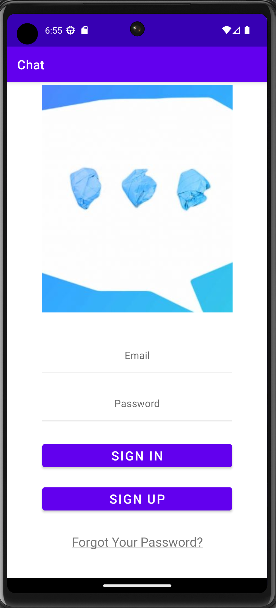
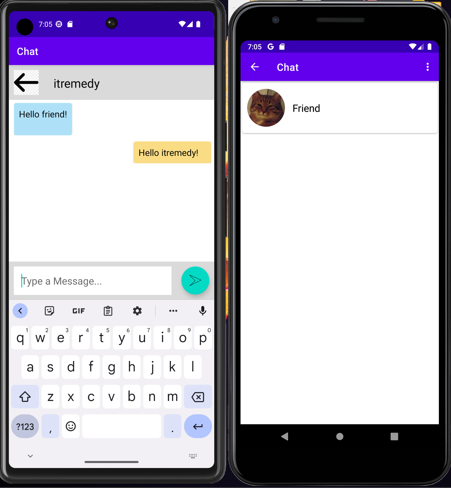

    # Chat App

<b>This app uses Firebase to store users information and chats. It's not very secure. I've created it only for studying purposes.</b>

**Requirements**
- Android studio last version
- JDK 8
- Android SDK 31
- Supports API Level +27
- Material Components 1.5.0-alpha04

**Demo** application is available in [Release]

**Screenshot**

**Libraries & Dependencies**
- [Support libraries]: appcompat / recyclerview / constraintlayout
- [Firebase]: auth / database / storage
- implementation 'com.google.android.material:material:1.8.0'
- implementation 'de.hdodenhof:circleimageview:3.1.0'
- implementation 'com.squareup.picasso:picasso:2.8'
  
